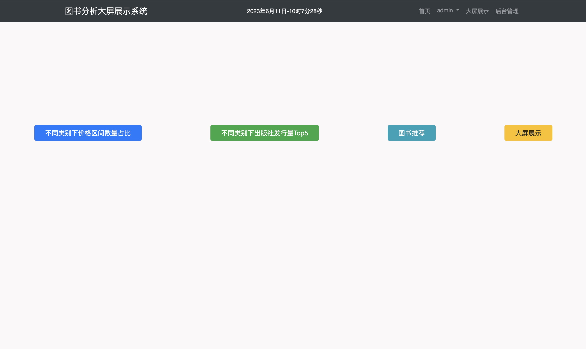
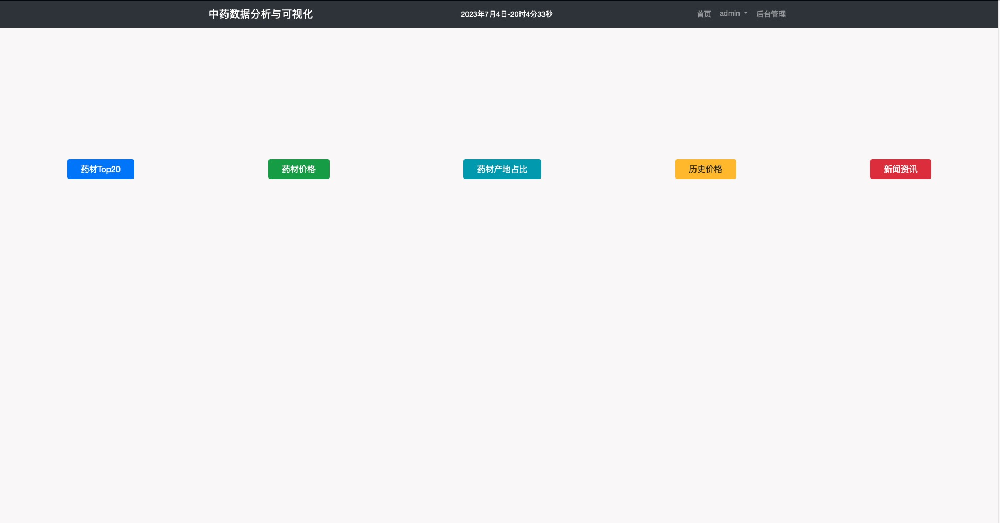
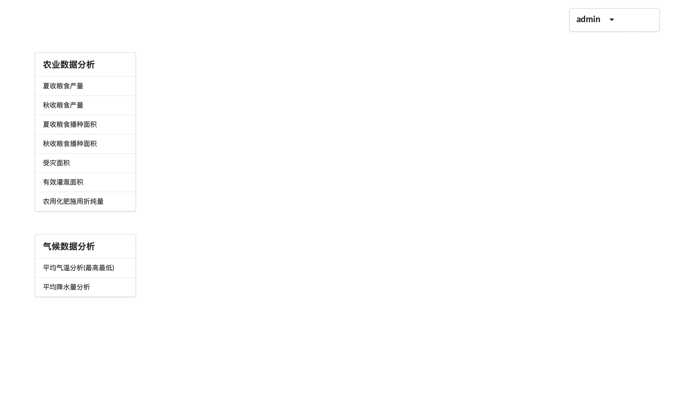

# Django 数据分析与可视化项目入口

这里是 TreasureLZ 的 Django 数据分析与可视化项目总入口，面向本科、专科学生和 Python Web 初学者，集中整理可用于课程设计、毕业设计、项目练习和二次开发的开源项目。

本仓库当前承担“索引 + 说明 + 路线图”的角色：完整源码放在各个子项目仓库中，本仓库提供项目选择、截图预览、学习路线和后续建设规划。

## 适合谁

- 想找一个能落地运行的 Python / Django 课程设计项目
- 想学习“数据采集、数据清洗、数据入库、可视化展示”的完整流程
- 想围绕公开数据做毕业设计、答辩演示或项目作品集
- 想基于已有项目继续改功能、换数据集、换图表或扩展分析维度

## 项目入口

| 编号 | 项目 | 方向 | 主要技术 | 适合场景 | 源码 |
| --- | --- | --- | --- | --- | --- |
| DP20230001 | 图书分析大屏展示系统 | 图书数据分析、推荐、可视化大屏 | Django, MySQL, 爬虫, 数据清洗, Bootstrap, ECharts | 入门级 Web 数据分析项目、课程设计 | [Book_Analysis](https://github.com/TreasureLZ/Book_Analysis) |
| DP20230002 | 药材数据可视化系统 | 药材价格、产地、资讯、历史价格分析 | Django, MySQL, 爬虫, JQuery, ECharts | 数据可视化展示、行业数据分析 | [Herbs_Analysis](https://github.com/TreasureLZ/Herbs_Analysis) |
| DP20230003 | 农业生产可视化系统 | 农业指标、气象数据、地图与图表分析 | Django, MySQL, Semantic UI, ECharts | 毕业设计、公开数据分析、综合看板 | [Agriculture_Analysis](https://github.com/TreasureLZ/Agriculture_Analysis) |

## 项目预览

### 图书分析大屏展示系统



核心内容：图书数据采集、价格区间统计、出版社发行量 Top5、图书推荐、后台管理和可视化大屏。

### 药材数据可视化系统



核心内容：药材价格统计、药材 Top20、产地占比、历史价格、新闻资讯和后台管理。

### 农业生产可视化系统



核心内容：农业指标表格、柱状图、饼图展示，以及平均气温地图、降水量合并图等气象数据可视化。

## 如何选择项目

| 目标 | 推荐项目 | 原因 |
| --- | --- | --- |
| 第一次接触 Django 数据分析项目 | 图书分析大屏展示系统 | 业务容易理解，功能完整，适合从页面、模型、数据处理开始学习 |
| 想做行业数据可视化 | 药材数据可视化系统 | 数据主题明确，图表展示集中，适合替换为其他行业数据 |
| 想做毕业设计或综合项目 | 农业生产可视化系统 | 同时包含农业数据和气象数据，扩展空间更大 |
| 想重点练习图表和大屏 | 图书分析大屏展示系统、农业生产可视化系统 | 包含多类统计图、地图和大屏展示页面 |

## 推荐学习路线

1. 先通读本仓库 README，选择一个和自己课题最接近的项目。
2. 进入对应源码仓库，按 README 配置 Python、MySQL、依赖和数据库。
3. 先跑通原项目，不急着改功能。
4. 读懂数据来源、数据清洗脚本、数据库表结构和页面展示逻辑。
5. 替换一份自己的数据，完成一次“同结构换主题”的改造。
6. 再增加新图表、新筛选条件、新统计指标或新页面。
7. 最后整理项目说明、运行截图、演示视频和答辩文档。

## 后续建设方向

根据“面向本科/专科学生的数据分析与可视化项目库”的定位，后续建议逐步从“Django 源码集合”升级为“可复现、可运行、可扩展、可讲解的数据分析与可视化模板库”。

优先建设方向：

- 增加更轻量的 Python 数据分析项目模板：pandas + Jupyter + Streamlit
- 增加官方公开数据选题：宏观经济、高校分布、人口婚姻、空气质量、5A 景区、快递运行、交通运输、能源装机、专利统计等
- 为每个项目补齐环境版本、运行步骤、数据来源、截图、常见问题和二次开发建议
- 使用 GitHub Releases 发布稳定版本，使用 GitHub Pages 或 Streamlit Cloud 提供在线演示入口
- 增加 issue 模板、贡献指南和项目文档模板，方便学生提交问题和新的选题建议

更详细的建设建议见 [docs/repository-guide.md](docs/repository-guide.md)。

## 仓库结构

```text
Django_Collection/
├── README.md
├── docs/
│   ├── project-template.md
│   └── repository-guide.md
├── Agriculture_Analysis/images/
├── Book_Analysis/images/
└── Herbs_Analysis/images/
```

## 交流

- GitHub 主页：[TreasureLZ](https://github.com/TreasureLZ)
- 微信：Treasures-LZ
- QQ：1664573841

如果这个入口对你有帮助，可以 star 支持，也欢迎通过 issue 提出项目运行问题、选题建议或文档改进建议。

## 许可与使用说明

本仓库用于学习交流和项目展示。使用各子项目源码前，请先阅读对应仓库的 README、依赖说明、数据来源说明和许可要求。

## 最后维护时间

2026.04.29
